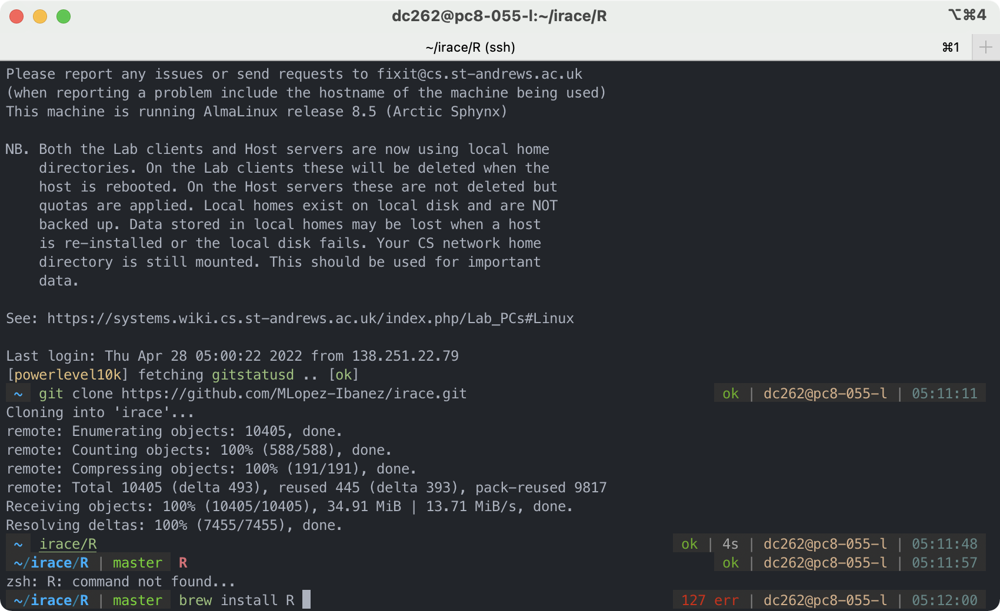

# Introduction
The machines in the labs can sometimes be quite difficult to work especially with broken a gcc complier, and no package manager. This scripts sets up homebrew as your package manager, installs a working gcc-11, and a nice shell environment. 

# Installation
```bash
/usr/bin/env bash -c "$(curl -fsSL https://raw.githubusercontent.com/STAOJ/sta-setup/master/setup.sh)"
```

And then restart your shell for it to take effect.

# Features
1. linuxbrew, with which you can install up-to-date packages without asking admins.
2. A working and up-to-date gcc complier.
3. zsh: nicer experience than bash overall.
4. Syntax highting in shell.
5. Autocompletion in shell: it remembers your recent commands and autocompletes the shell command.
6. git stats: ti shows you which branch you are on in the command prompt, changes, untracked files, upstream and local difference, etc. 

# What it looks like after installation


# Troubleshooting
1. Build failure with `brew install`.

    The make complier on the lab machines is a bit broken. We haven't found a way to fix it yet, but you can workaround many build failures with `brew install --force-bottle` to use a "bottle" (pre-complied binary). Homebrew defaults to building from source because it is not installed in `/home/linuxbrew/.linuxbrew` (for which you don't have write permission). 

2. Problem with PATH.

    Try to add the PATH in `~/.profile`, which will get loaded.

# Uninstallation
Just remove `~/.linuxbrew`. It will also remove every packages you installed with homebrew.

You should also removed the line in `~/.bashrc` that reads `/home/aa001/.linuxbrew/bin/zsh` where `aa001` is your username.

# Customization
The theme used is powerlevel10k, applied on oh-my-zsh. the font for p10k is chosen for the compatibility. If you want to customize the prompt look, run `p10k configure`. 

You can also read more about the two packages to learn more about what they can do. 